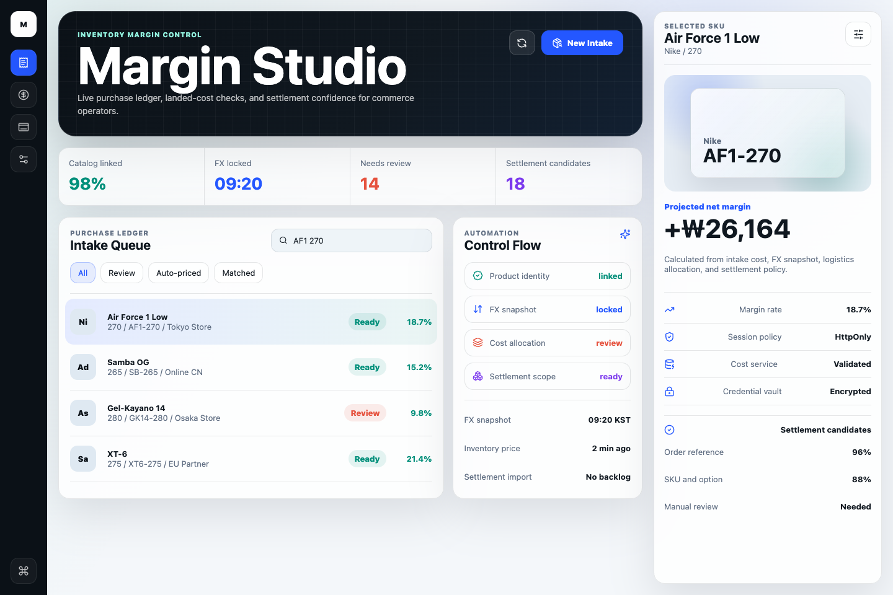
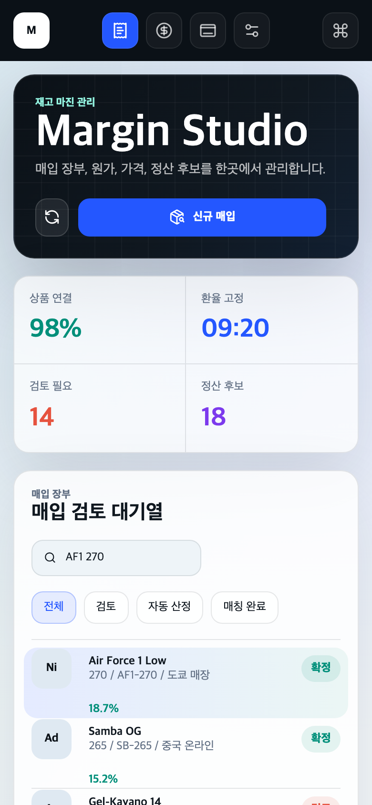

# Commerce Ops Automation | 커머스 운영 자동화

`Margin Studio`는 매입 등록, 원가 검토, 가격 점검, 정산 후보 매칭을 한 화면에서 처리하기 위한 커머스 운영 콘솔입니다.<br />
`Margin Studio` is a commerce operations console for purchase intake, landed-cost review, pricing checks, and settlement matching.

고객 데이터, 핵심 산식, 외부 파트너 연동 세부사항은 제외하고, 운영 자동화 시스템의 구조와 구현 역량을 검증할 수 있도록 재구성한 공개 포트폴리오 레포입니다.  
This public case-study repository preserves the engineering shape of a production-grade operations system while replacing customer data, proprietary formulas, and partner details with anonymized sample data and a public calculation policy.



## 🧰 기술 태그 / Tech Tags


`Next.js 15` · `React 19` · `NestJS 11` · `TypeScript` · `zod` · `pnpm workspace` · `Turborepo` · `Docker` · `Caddy`

## ✨ 핵심 요약 / Highlights

- **실무형 모노레포 구조**: `web`, `api`, `shared`, `infra`를 분리해 프론트엔드, API, 공통 정책, 배포 구성을 독립적으로 검토할 수 있게 했습니다.  
  **Production-oriented monorepo**: `web`, `api`, `shared`, and `infra` are separated for clear review boundaries.
- **운영자 중심 UI**: queue 상태, margin health, sync status, settlement confidence를 빠르게 스캔할 수 있는 고밀도 작업 화면을 구현했습니다.  
  **Operator-first UI**: the console is built for fast scanning of queue state, margin health, sync status, and settlement confidence.
- **공유 검증 경계**: zod schema와 계산 정책을 `packages/shared`에 두어 Web/API가 같은 타입과 정책을 재사용합니다.  
  **Shared validation boundary**: zod schemas and calculation policy are reused by both the Next.js app and NestJS API.
- **확장 가능한 API 구조**: NestJS module/controller/service 경계를 유지해 persistence, auth, scheduled sync로 확장 가능한 형태를 보여줍니다.  
  **Extensible API shape**: NestJS module/controller/service boundaries leave room for persistence, auth, and scheduled sync jobs.
- **배포 고려 인프라**: Docker image와 Caddy reverse proxy 구성을 포함해 API 패키징과 노출 방식을 보여줍니다.  
  **Deployment-aware infrastructure**: Docker and Caddy show how the API can be packaged and exposed behind a reverse proxy.

## 🧩 구현 포인트 / Implementation Notes

반복적인 커머스 운영 업무를 제품 화면, API 경계, 검증 가능한 정책 레이어로 분해했습니다.  
Repetitive commerce operations are separated into product surfaces, API boundaries, and testable policy layers.

- **작업면 중심 구성 / Workspace-first composition**: 첫 화면을 랜딩 페이지가 아닌 실제 운영 콘솔로 구성했습니다.
- **직접 구성한 UI 시스템 / Hand-built UI system**: UI kit 없이 responsive layout, rail navigation, state badge, mobile stacking을 구현했습니다.
- **분리된 API 경계 / Layered API boundary**: route handling, service policy, shared validation을 분리했습니다.
- **검증 가능한 계산 정책 / Testable calculation policy**: 계산 로직을 `packages/shared`에 격리하고 단위 테스트를 추가했습니다.
- **운영 가능한 배포 구조 / Deployable infrastructure shape**: `infra/docker`에 API Dockerfile, Caddy reverse proxy, compose 구성을 포함했습니다.

## 🎛️ UI/UX



- **제품명 중심 첫인상 / Product-led first impression**  
  `Margin Studio`를 실제 제품처럼 보이게 구성하고, 운영 상태와 작업 큐가 바로 이어지도록 설계했습니다.
- **운영자 우선 레이아웃 / Operator-first layout**  
  데스크톱에서는 내비게이션, 매입 장부, 자동화 상태, 검토 패널을 분리해 컨텍스트를 유지하며 검토할 수 있습니다.
- **모바일 연속성 / Mobile continuity**  
  모바일에서는 같은 흐름을 세로형 review path로 재배치해 search, filter, margin signal을 유지합니다.
- **상태 중심 정보 구조 / Status-driven hierarchy**  
  queue state, FX lock, cost review, settlement candidates를 보조 정보보다 먼저 볼 수 있게 했습니다.

## 🏗️ 아키텍처 / Architecture

```txt
commerce-ops-automation/
├── apps/
│   ├── web/              # Next.js operator console
│   └── api/              # NestJS API boundary
├── packages/
│   └── shared/           # shared schemas, sample data, calculation policy
├── infra/
│   ├── docker/           # API Dockerfile, Caddy reverse proxy, compose file
│   └── deploy/           # deployment notes
├── docs/
│   ├── architecture.md
│   └── screenshots/
└── README.md
```

더 자세한 런타임 구조는 [docs/architecture.md](docs/architecture.md)에서 확인할 수 있습니다.  
See [docs/architecture.md](docs/architecture.md) for the runtime architecture.

## 🔍 코드 리뷰 가이드 / Review Guide

구현을 검토하려면 아래 파일부터 보는 것을 추천합니다.  
Recommended entry points for implementation review:

| 관심사 / Concern                     | 위치 / Path                         |
| ------------------------------------ | ----------------------------------- |
| UI composition                       | `apps/web/src/app/page.tsx`         |
| Responsive visual system             | `apps/web/src/app/globals.css`      |
| Shared schema and calculation policy | `packages/shared/src/index.ts`      |
| Calculation unit test                | `packages/shared/src/index.test.ts` |
| API service boundary                 | `apps/api/src/modules/purchases`    |
| Runtime architecture notes           | `docs/architecture.md`              |
| Docker/Caddy deployment shape        | `infra/docker`                      |

## 🔌 API Surface

공개 API는 의도적으로 작게 유지했습니다.  
The public API surface is intentionally small.

- `GET /api/health`
- `GET /api/purchases`
- `POST /api/purchases/quote`

`POST /api/purchases/quote`는 shared zod schema로 입력을 검증하고 `packages/shared`의 공개 계산 정책 결과를 반환합니다.  
`POST /api/purchases/quote` validates input with the shared zod schema and returns the public calculation result from `packages/shared`.

## 🚀 로컬 실행 / Local Development

```bash
nvm use
pnpm install
pnpm dev
```

기본 로컬 포트 / Default local ports:

- Web: `http://localhost:3010`
- API: `http://localhost:4010/api`

개별 앱 실행 / Run individual apps:

```bash
pnpm --filter @commerce-ops/web dev
pnpm --filter @commerce-ops/api dev
```

## ✅ 검증 / Verification

```bash
pnpm lint
pnpm test
pnpm typecheck
pnpm build
```

검증 항목 / Current checks:

- ESLint 9 flat config 기반 workspace lint
- TypeScript strict-mode checks
- Shared calculation unit test
- Next.js production build
- NestJS TypeScript build

## 🛠️ 트러블슈팅 / Troubleshooting

구현 중 실제로 발생했고 검증 흐름까지 개선한 에러만 남겼습니다.<br />
Only the issue that led to a concrete verification improvement is listed here.

### Next.js 생성 타입 누락으로 Web 검증 실패 / Missing Next.js Generated Types

- **발생 명령 / Command**: `pnpm test`
- **에러 / Error**:

```txt
@commerce-ops/web:test: error TS6053: File 'apps/web/.next/types/app/layout.ts' not found.
@commerce-ops/web:test: error TS6053: File 'apps/web/.next/types/app/page.ts' not found.
@commerce-ops/web:test: error TS6053: File 'apps/web/.next/types/cache-life.d.ts' not found.
```

- **원인 / Cause**: `apps/web/tsconfig.json`이 `.next/types/**/*.ts`를 include하고 있었지만, `test`와 `typecheck` 스크립트는 `tsc --noEmit`만 실행했습니다. `.next/types`는 `next build`, `next dev`, 또는 `next typegen` 이후에 생기기 때문에 clean checkout이나 병렬 검증 순서에서는 타입 파일이 없는 상태로 `tsc`가 먼저 실행됐습니다.
- **해결 / Resolution**: Web package의 `test`와 `typecheck`를 `next typegen && tsc -p tsconfig.json --noEmit`으로 변경해 검증 전에 Next.js route/page/layout 타입 생성을 보장했습니다.
- **배운 점 / Lesson**: Next.js App Router 프로젝트에서 `.next/types`를 TypeScript program에 포함한다면, 검증 명령 자체가 typegen 선행 조건을 가져야 합니다. build 산출물이 우연히 남아 있는 로컬 상태에 기대면 CI나 새 환경에서 같은 명령이 실패합니다.

## 🧾 공개 범위 / Public Scope

포함한 것 / Included:

- 운영 콘솔 UI / Operator console UI
- 모노레포 구조 / Monorepo structure
- API, service, shared package 경계 / API, service, and shared package boundaries
- 비식별 샘플 데이터 / Anonymized sample data
- 공개용 계산 정책 / Public calculation policy
- Docker/Caddy 기반 배포 형태 / Docker/Caddy deployment shape

포함하지 않은 것 / Not included:

- 고객사명 또는 운영 데이터 / Customer names or operating data
- 계약, 견적, 내부 커뮤니케이션 / Contract, quote, or internal communication
- 고유 스프레드시트 산식 / Proprietary spreadsheet formulas
- 실제 외부 파트너 endpoint 또는 token flow / Real external partner endpoints or token flows
- 운영 도메인, secret, credential / Production domains, secrets, or credentials
