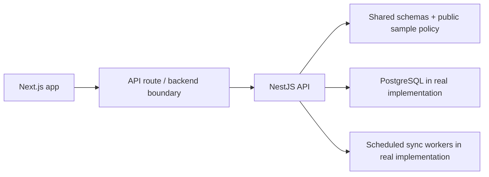

# Architecture

`commerce-ops-automation` is a public portfolio version of a commerce operations system.

## Design Goals

- Keep operational workflows visible: purchase intake, calculation state, settlement matching, and sync status.
- Remove proprietary formulas, client data, credentials, and partner-specific API details.
- Preserve the engineering shape: monorepo, shared schemas, API boundary, and deployable infrastructure.

## Runtime Shape

## What Is Intentionally Omitted

- Client name, quote, and contractual details.
- Exact calculation formulas and source spreadsheet mapping.
- Real marketplace endpoints, token flows, and account data.
- Real FX provider credentials and production domains.

## What Remains

- UI structure for high-density operational workflows.
- Route and service boundaries for a NestJS API.
- Shared validation and deterministic calculation facade.
- Docker/Caddy deployment shape.
- README screenshots and implementation notes for reviewers.
